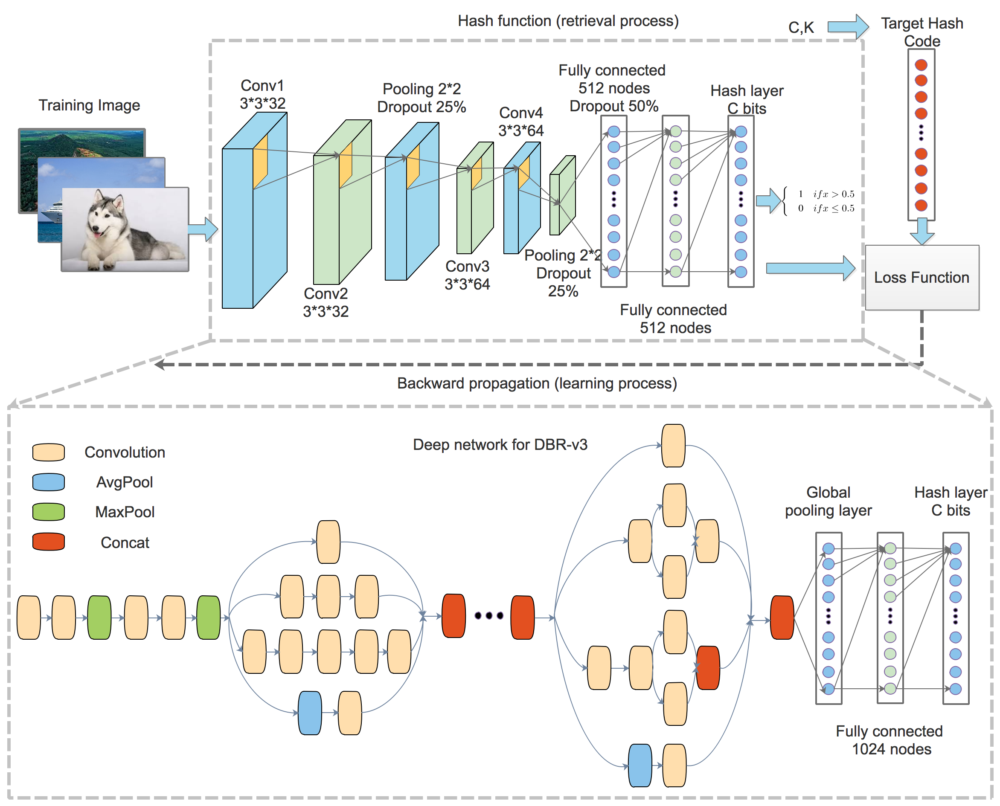

# DeepBinaryRepre

Source code of paper ['Deep Binary Representation for Efficient Image Retrieval'](https://www.hindawi.com/journals/am/2017/8961091/)

This work is done by [Media Lab](http://medialab.sjtu.edu.cn/) of Shanghai Jiaotong University.

Welcome to cite our paper:

Lu X, Song L, Xie R, et al. Deep Binary Representation for Efficient Image Retrieval[J]. Advances in Multimedia, 2017, 2017.

## Statement

This is the demo code of our image retrieval system. The code runs the training and image retrieval phase on CIFAR-10 dataset. After careful tuning of the hyperparameters, the performance can reach the level described in our paper.

## Environment

Python is needed to run this code. Python 2.7 is tested and python 3.x should also work fine.

All the packages needed are listed in requirements.txt.

Tensorflow and Keras are recommended to run the code, Theano will also work but not so efficient.

Using CPU to train is time-consuming, we suggest using GPU to train the network. With GPU, the whole training phase will be less than 10 minutes.

## Hyperparameters

This code provides convenient way to parse hyperparameters. Type `python retrieval.py --help` to see how to use commandline to control the hyperparameters.

- -l L The length of the hash code. 12, 24, 36, 48 in our paper.
- -q Q Number of query images in retrieval phase. The smaller the faster. Max=10000.
- -e E Number of training epoches. Suggest value: 20.
- -s S 0.silent, 1.log. Use 0 to suppress the output of training progress rate.
- -t T Number of images retrieved for every query image. Max=50000.
- -o O Training optimizer: 1.adadelta 2.sgd
- -a A Additional AC layer: 1.no 2.yes. Please use the default setting.
- -c C Hash code type: 1.origin 2.74. Please use the default setting.
- -n N Number of training images. Default=50000. If you want to see fast training, you can set it to 5000.

To run the code, for example: train 20 epoches,  use 100 query images to retrieve top 1000 images:

```
python -W ignore retrieval.py -e 20 -t 1000 -q 100
```


